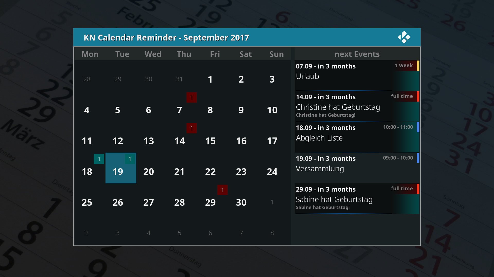

<h1>KN Notizkalender (Google Kalender)</h1>
<h2>Hinweise für Skinner und Programmierer</h2>

Sowohl der Content für das Kalenderblatt auf der linken Seite als auch die Terminliste rechts werden über ein dynamisches Content-Listing per Plugin-Aufruf über die Content-Methode aus der GUI heraus bereitgestellt (siehe auch: http://kodi.wiki/view/Dynamic_List_Content)

<h3>Aufruf für das Kalenderblatt:</h3>

```
<content>plugin://service.calendar?action=getcontent&amp;content=sheet&amp;month=$INFO[Window(Home).Property(calendar_month)]&amp;year=$INFO[Window(Home).Property(calendar_year)]</content>
```


<h4>Parameter:</h4>

```
action=getcontent       Steuerparameter für den Controller des Addons
content=sheet           Content wird für Kalenderblatt bereitgestellt
month=9                 darzustellender Monat
year=2017               darzustellendes Jahr
```


Die Parameter können natürlich auch über Window-Properties (wie oben) eingelesen werden.

Für das Kalenderblatt werden immer 42 ListItems bereitgestellt, da ein Kalenderblatt in ein Raster von 7x6 Items (7 Tage/Woche, 6 Wochen) eingepasst wird. Daduch ergeben sich Vorläufer (Tage vom vorherigen Monat) und Nachläufer (Tage des folgenden Monats), die für das aktuelle Blatt jedoch nicht relevant sind und das Property 'valid=0' besitzen. Die Tage des aktuellen Monats besitzen das Property 'valid=1'.

Properties (ListItems):

```
ListItem.Label:                 1...31  Tag des Monats (min. 1...28, max. 1...31)
ListItem.Label2:                0...x   Anzahl der Termine an diesem Tag
ListItem.Property(valid):       0|1     ListItem ist Vor-/Nachläufer (valid:0) oder Item des aktuellen Monats (valid:1)
ListItem.Property(allday):      0|1     wenigstens ein Termin ist ein Ganztagstermin (allday:1)
ListItem.Property(today):       0|1     ListItem ist aktueller Tag/Heute (today:1)
ListItem.Property(ids):                 Event-IDs (Schlüssel) aus dem Googlekalender, kommagetrennt
ListItem.Property(specialicon):         Icon für spezielle Termine (z.Zt. nur Geburtstage)
ListItem.Property(eventicon):           Icon für Termine ohne Ganztagstermine, mit mind. einem Ganztagstermin, mit mehrtägigen Terminen
```

<h3>Aufruf der Terminliste</h3>

```
<content>plugin://service.calendar?action=getcontent&amp;content=eventlist&amp;month=$INFO[Window(Home).Property(calendar_month)]&amp;year=$INFO[Window(Home).Property(calendar_year)]</content>

```

<h4>Parameter:</h4>

```
action=getcontent       Steuerparameter für den Controller des Addons
content=eventlist       Content wird für Terminliste bereitgestellt (max. 30 Termine)
month=9                 Liste ab darzustellenden Monat
year=2017               Liste ab darzustellendes Jahr
```

Die Anzahl der ListItems variiert von 0 (keine Termine) bis max. 30 Einträge. Folgende ListItems/Properties werden bereitgestellt:

Properties/ListItems:

```
ListItem.Label:                 Datum des Termins in Kurzform und (optional) Zeitpunkt des Termins, z.B. '07.09 - in 2 Monaten'
ListItem.Label2:                Beschreibung/Termin
ListItem.Icon:                  Farbgrafik des zugehörigen Kalenders (Google-Kalenderfarbe), wird on the Fly erzeugt
ListItem.Property(id):          Event-Id des Kalendereintrags (Google)
ListItem.Property(range):       Zeitdauer (11:00 - 12:00 Uhr|ganztags)
ListItem.Property(allday):      Marker für Ganztagstermin (0|1)
ListItem.Property(description): zusätzliche Beschreibung oder Ort des Termins (Beschreibung wird zuerst genommen)

```

